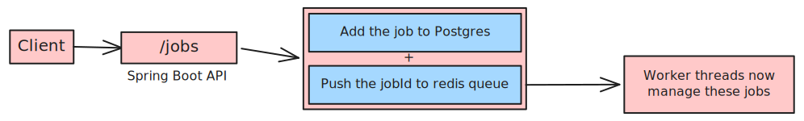
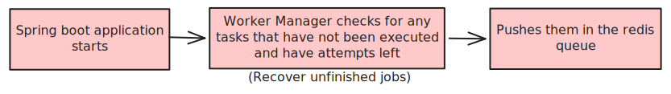
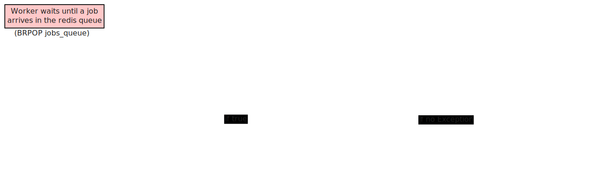

# Job Queue System
( Built with Spring Boot, Postgres and Redis )

The system allows clients to submit jobs through a `/jobs` api. The jobs are then persisted in PostgreSQL and processed by worker threads that consumes tasks from a Redis queue.

- The jobs are retried if failed upto the number of `max_attempts` passed while submission of jobs ( default set to `1`).
- Any job can be implemented by the `JobHandler` interface.
- Each job has four states `QUEUED`, `RUNNING`, `SUCCESS`, `FAILED`.
- Database schema contains a `result` field of type `JSONB` that can be filled by the `JobHandler`.


## Architecture overview
- PostgreSQL -> Stores the job metadata, payloads, error, status, attempts, max_attempts
- Redis -> Acts as a queue for the work to be distributed to workers
- Workers -> Threads that consume the jobs from the Redis queue and execute handlers
- On application startup, all unfinished jobs(if any) in the database are pushed into the redis queue again.



## Application startup


## Worker execution flow



## API

### Submit Job
> **POST** `/jobs`

Request:
```json
{
    "type": "image.process",
    "payload": {
        "imageId": 42
    },
    "maxAttempts": 2
}
```
- If no maxAttempts is passed, it fallbacks to the defualt value decided in the database schema.
- The `type` field must match the bean name of the class that implements the `JobHandler` interface.

Response:
```json
{
    "id": "2ba9acae-fc98-4c44-bb0a-341a7081a8da"
}
```

### Get Job
> **GET** `/jobs/{id}`

Response: (Returns job details as shown in the example)
```json
 {
    "id": "2ba9acae-fc98-4c44-bb0a-341a7081a8da",
    "type": "image.process",
    "payload": {
      "imageId": 5
    },
    "status": "SUCCESS",
    "attempt": 1,
    "maxAttempts": 1,
    "createdAt": "2026-04-04T17:33:51.087+00:00",
    "startedAt": "2026-04-04T17:33:51.110+00:00",
    "finishedAt": "2026-04-04T17:33:52.127+00:00",
    "result": null,
    "error": null
  }
```
### List jobs
> **GET** `/jobs?status=FAILED`

`status` is optional, it can have values as:
- QUEUED
- RUNNING
- FAILED
- SUCCESS

If `status` passed it returns the jobs with that `status`, if only GET at `/jobs` without `status`, then all the jobs in the database are returned.

Response:
```json
[
  {
    "id": "2ba9acae-fc98-4c44-bb0a-341a7081a8da",
    "type": "image.process",
    "payload": {
      "imageId": 5
    },
    "status": "SUCCESS",
    "attempt": 1,
    "maxAttempts": 1,
    "createdAt": "2026-04-04T17:33:51.087+00:00",
    "startedAt": "2026-04-04T17:33:51.110+00:00",
    "finishedAt": "2026-04-04T17:33:52.127+00:00",
    "result": null,
    "error": null
  }
]
```
Response is an array of jobs.

## Implementing the JobHandler
Jobs are to be implemented using the JobHandler interface.
```java
public interface JobHandler {
    public void execute(JsonNode payload) throws Exception;
}
```
Example:
```java
@Component("image.process")
public class ImageJobHandler implements JobHandler {

    //assume payload has {imageId: <int>}
    @Override
    public void execute(JsonNode payload) throws Exception {
        int imageId = payload.get("imageId").asInt();
        // whatever job is to be done
        Thread.sleep(1000);
        System.out.println("Image processed: " + imageId);
    }
}
```

## Setting up the project
For secrets export these in your shell
- DB_URL 
- DB_USER
- DB_PASSWORD
- REDIS_URL

Example assuming you spin up the docker compose:
```
export DB_URL=jdbc:postgresql://localhost:5432/jobqueue
export DB_USER=jobuser
export DB_PASSWORD=jobpass
export REDIS_URL=redis://localhost:6379
```
The above example will work if using the docker-compose of the project. Spin them up with `sudo docker compose up`.

Then execute these commands:

```bash
./mvnw install
./mvnw spring-boot:run
```
